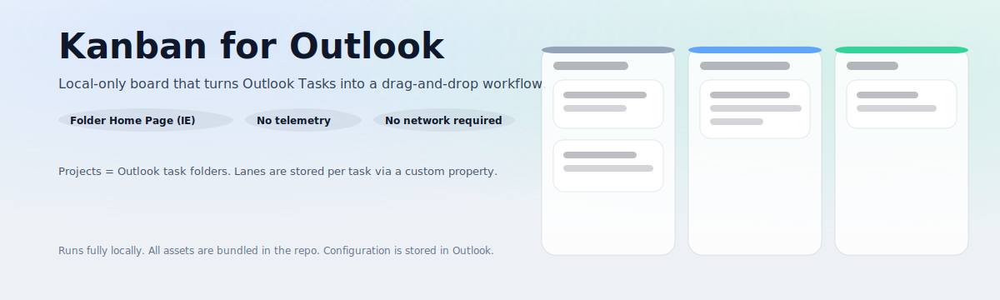

# Kanban for Outlook

Local-only Kanban board for classic Microsoft Outlook Tasks (Windows desktop).

[Setup](docs/SETUP.md) | [Usage](docs/USAGE.md) | [Projects](docs/PROJECTS.md) | [Themes](docs/THEMES.md) | [Theme Authoring](docs/THEME_AUTHORING.md) | [Troubleshooting](docs/TROUBLESHOOTING.md)

This repository continues **JanBan**, which is based on the original **Outlook Taskboard** by Evren Varol.
Credits: [`ACKNOWLEDGEMENTS.md`](ACKNOWLEDGEMENTS.md).

Maintainer: Iman Sharif.

> [!IMPORTANT]
> Non-negotiable: local-only. No external downloads, update checks, telemetry, or prefilled support email targets.

## What it is

- A board UI hosted as an Outlook Folder Home Page (classic Outlook on Windows)
- Projects = Outlook Task folders
- Lanes stored on each task via Outlook user properties (`KFO_LaneId`, optional ordering via `KFO_LaneOrder`)

```mermaid
flowchart LR
  A[Classic Outlook for Windows\nFolder Home Page (IE engine)] --> B[kanban.html]
  B --> C[AngularJS UI]
  C <--> D[Outlook Tasks + Folders\n(local profile)]
  C --> E[Outlook Journal Items\nKanbanConfig / KanbanState]
```

## Features

- Modern light/dark UI with density + motion controls
- Fully configurable lanes (title, color, WIP limit, optional Outlook Status sync)
- Projects as folders: create, link existing folders, hide/show, rename
- Tools: migrate lanes from Outlook Status, move tasks between projects
- Theme system: built-in themes + local theme import + folder themes ([`themes/`](themes/))

## Setup (local)

1) Download and extract the release zip to a folder you control.
2) Run `install.cmd` (or `install-local.cmd`).
3) Restart Outlook.

The installer copies files to `%USERPROFILE%\kanban-for-outlook` and registers `kanban.html` as the Folder Home Page.

See [`docs/SETUP.md`](docs/SETUP.md) for detailed steps and manual install.

## Documentation

- Start here: [`docs/README.md`](docs/README.md)
- Architecture: [`docs/ARCHITECTURE.md`](docs/ARCHITECTURE.md)
- Setup: [`docs/SETUP.md`](docs/SETUP.md) (includes manual install)
- Usage: [`docs/USAGE.md`](docs/USAGE.md)
- Projects: [`docs/PROJECTS.md`](docs/PROJECTS.md)
- Migration: [`docs/MIGRATION.md`](docs/MIGRATION.md)
- Themes (end-user): [`docs/THEMES.md`](docs/THEMES.md)
- Theme authoring (creators): [`docs/THEME_AUTHORING.md`](docs/THEME_AUTHORING.md)
- SmartScreen: [`docs/SMARTSCREEN.md`](docs/SMARTSCREEN.md)
- Troubleshooting: [`docs/TROUBLESHOOTING.md`](docs/TROUBLESHOOTING.md)
- Privacy: [`PRIVACY.md`](PRIVACY.md)
- Security: [`SECURITY.md`](SECURITY.md)
- Third-party notices: [`THIRD_PARTY_NOTICES.md`](THIRD_PARTY_NOTICES.md)
- Disclaimer: [`DISCLAIMER.md`](DISCLAIMER.md)

## Security + privacy

Everything stays in your local Outlook profile.

- No network access required
- Config + state stored in Outlook Journal items
- Tasks are read/written via Outlook COM/MAPI

See [`PRIVACY.md`](PRIVACY.md) and [`SECURITY.md`](SECURITY.md).

## Compatibility

- Supported: classic Outlook for Windows (Folder Home Page / IE engine)
- Not supported: new Outlook, Outlook on the web, macOS

## Roadmap

See [`ROADMAP.md`](ROADMAP.md).

## Disclaimer

This project is provided "AS IS" with no warranty. See [`DISCLAIMER.md`](DISCLAIMER.md) and [`LICENSE`](LICENSE).

## License

MIT, see [`LICENSE`](LICENSE).
