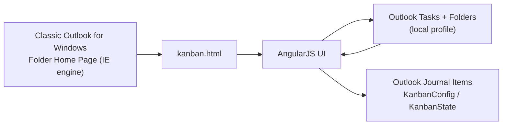

# Kanban for Outlook

A local-only Kanban board that turns classic Microsoft Outlook Tasks into a drag-and-drop workflow (Windows desktop).

Kanban began at Toyota as a way to manage flow using visual signals, and it's now a practical method for personal task management: make work visible, limit work in progress, and focus on finishing ([Kanban on Wikipedia](https://en.wikipedia.org/wiki/Kanban)). Outlook is the day-to-day hub in many organisations, so keeping your board alongside your mail and calendar makes it easier to stay on top of work.

I use this every day and have benefited from it greatly. That's why I'm maintaining this fork: to keep it usable, local-only, and to help you improve your productivity and task management inside Outlook.

[Download latest zip](https://github.com/Iman-Sharif/Outlook-Kanban/releases/latest/download/kanban-for-outlook.zip) | [Start here](START_HERE.html) | [Setup](docs/SETUP.md) | [Usage](docs/USAGE.md) | [Themes](docs/THEMES.md)

This repository continues **JanBan**, which is based on the original **Outlook Taskboard** by Evren Varol.
Credits: [`ACKNOWLEDGEMENTS.md`](ACKNOWLEDGEMENTS.md).

Maintainer: Iman Sharif.

> [!IMPORTANT]
> Non-negotiable: local-only. No external downloads, update checks, telemetry, or prefilled support email targets.

## Get started (recommended)

1) Download: [`kanban-for-outlook.zip`](https://github.com/Iman-Sharif/Outlook-Kanban/releases/latest/download/kanban-for-outlook.zip)
2) Extract it.
3) Run `install.cmd` (or `install-local.cmd`).
4) Restart Outlook.

Tip: if you'd like a simple walkthrough, open `START_HERE.html`.

Optional verification:

- Checksum: [`kanban-for-outlook.zip.sha256`](https://github.com/Iman-Sharif/Outlook-Kanban/releases/latest/download/kanban-for-outlook.zip.sha256)

> [!IMPORTANT]
> For installation, do not use GitHub's green `Code` button -> `Download ZIP`.
> On the Releases page, do not download `Source code (zip/tar.gz)`.
>
> If you already downloaded a source code zip, you can still install (it just includes extra files): extract it, run `install.cmd`, then restart Outlook.

See [`docs/SETUP.md`](docs/SETUP.md) for the full setup guide (including manual install).

## What it is

- A board UI hosted as an Outlook Folder Home Page (classic Outlook on Windows)
- Projects = Outlook Task folders
- Lanes stored on each task via Outlook user properties (`KFOLaneId`, optional ordering via `KFOLaneOrder`; legacy: `KFO_LaneId`/`KFO_LaneOrder`)

## Features

- Modern light/dark UI with density + motion controls
- Fully configurable lanes (title, colour, WIP limit, optional Outlook Status sync)
- Projects as folders: create, link existing folders, hide/show, rename
- Tools: migrate lanes from Outlook Status, move tasks between projects
- Theme system: built-in themes + local theme import + folder themes ([`themes/`](themes/))

## Documentation

- Docs index: [`docs/README.md`](docs/README.md)
- Setup / upgrade / troubleshooting: [`docs/SETUP.md`](docs/SETUP.md)
- Using the board (projects, tools, migration): [`docs/USAGE.md`](docs/USAGE.md)
- Themes (including authoring): [`docs/THEMES.md`](docs/THEMES.md)
- Maintainers: [`docs/MAINTAINERS.md`](docs/MAINTAINERS.md)
- Privacy: [`PRIVACY.md`](PRIVACY.md)
- Security: [`SECURITY.md`](SECURITY.md)
- Third-party notices: [`THIRD_PARTY_NOTICES.md`](THIRD_PARTY_NOTICES.md)
- Disclaimer: [`DISCLAIMER.md`](DISCLAIMER.md)

## Security + privacy

Everything stays in your local Outlook profile.

- No network access required
- Config + state stored in Outlook Journal items
- Tasks are read/written via Outlook COM/MAPI

See [`PRIVACY.md`](PRIVACY.md) and [`SECURITY.md`](SECURITY.md).

## Compatibility

- Supported: classic Outlook for Windows (Folder Home Page / IE engine)
- Not supported: new Outlook, Outlook on the web, macOS

## Roadmap

See [`ROADMAP.md`](ROADMAP.md).

## Disclaimer

This project is provided "AS IS" with no warranty. See [`DISCLAIMER.md`](DISCLAIMER.md) and [`LICENSE`](LICENSE).

## License

MIT, see [`LICENSE`](LICENSE).

## Contributing

See [`CONTRIBUTING.md`](CONTRIBUTING.md).
